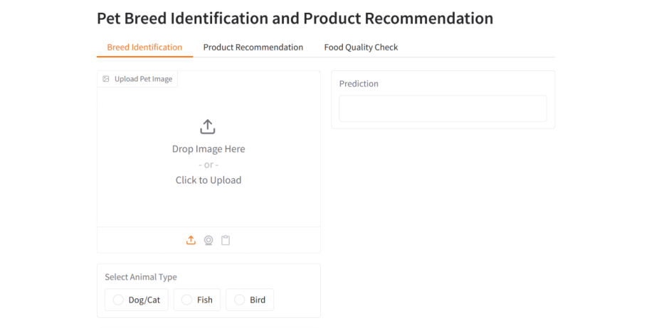

# Pet Breed Identification and Product Recommender
An integrated pet-care system that identifies pet breeds, checks food quality, and recommends suitable pet products.

## Preview

## 1. Project Overview

The system helps pet owners make better care decisions by:

Identifying pet breeds/species from images
Checking whether pet food is Safe, Moderate, or Unsafe
Recommending suitable pet products
Providing an interactive Gradio interface

The system supports Dog/Cat, Fish, and Bird classification.

## 2. Technologies Used
Python
PyTorch
Torchvision
Swin Transformer
BERT
Sentence Transformers
Gradio
Pandas
NumPy
Google Colab GPU

## 3. Models
Swin Transformer
Used for image-based pet breed/species identification.

Model:
swin_tiny_patch4_window7_224
BERT

Used to analyze pet food ingredient information and classify it as:
Safe | Moderate | Unsafe
Sentence Transformers
Used for semantic similarity-based product recommendation.

## 4. Datasets
Oxford-IIIT Pet Dataset – Dog and Cat breeds
Stanford Dogs Dataset – Dog breeds
CUB-200-2011 – Bird species
Fish Dataset – Fish classification
Pet Food Dataset – Food ingredient analysis
Pet Product Dataset – Product recommendations

## 5. Application Modules
🐾 Breed Identification
Upload an image, select the animal type, and receive the predicted breed/species with a confidence score.

🍖 Food Quality Check
Enter food ingredients and receive a classification:
Safe / Moderate / Unsafe

🛍️ Product Recommendation
Enter pet details such as type, breed, size, age, and weight to receive suitable product suggestions.
The three modules are integrated into a single Gradio interface.

## 6. Results
Module	Accuracy
Breed Identification	89.25%
Food Quality Check	66.67%
Product Recommendation	79.17%

## 7. Project Structure
Pet-Breed-Identification-Product-Recommender/
│
├── README.md
├── Pet_Breed_Identification_Product_Recommender.ipynb
└── project-preview.png

The notebook contains the complete project workflow, including dataset preparation, model training, evaluation, prediction, recommendation, and the Gradio interface.

## 8. How to Run
Open the notebook in Google Colab, run the cells in order, and run the Gradio section to launch the application.
